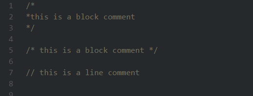

# Comment Extractor
> Extract all comments from a javascript project

### Currently only supporting js and jsx extesion

## Install
```console
$ npm install -g node-comment-extractor
```
> or
```console
$ npm install --save-dev node-comment-extractor
```
## Usage
```console
$ comment-extractor -e your-project
```

> output


### write comments to a file
```console
$ comment-extractor -e your-project -w comments.txt
```
## Options
```
-V, --version                          output the version number
-e, --extract <filename | foldername>  extract comments and log to console
-w, --write <filename>                 extract comments and write to a file
-h, --help                             output usage information
```
## License

MIT


